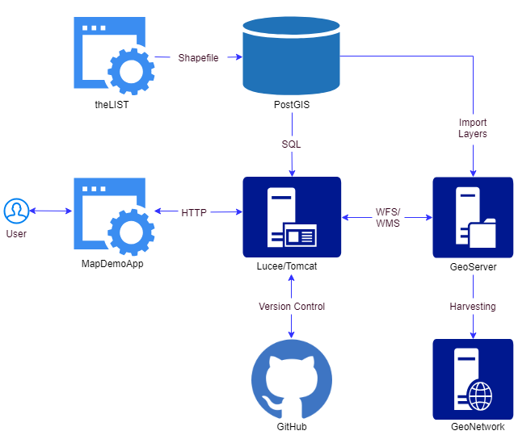

# MapDemoApp #

The aim of this document is to provide the technical specification of the developed web application - MapDemoApp, solely developed for demonstration purpose.

Features
* The main feature of this web application is to visualise Local Government Areas (LGAs) in the map of Tasmania, Australia.
* Ability to display different types of base maps (e.g. theList, USGS, OpenStreetMap).
* Ability to display different spatial layers (e.g. LGAs, Water Bodies)
* Ability to show spatial information in map and tabular form.
* Ability to connect to GeoServer to extract map and features information using WMS (Web Map Service) and WFS (Web Feature Service) functionalities.

System Architecture

Quick technical document
* Please visit this <a target="_blank" href="https://github.com/sachitrajbhandari/MapDemoApp/raw/master/docs/quick_technical_guide.pdf">link</a> for quick technical document
